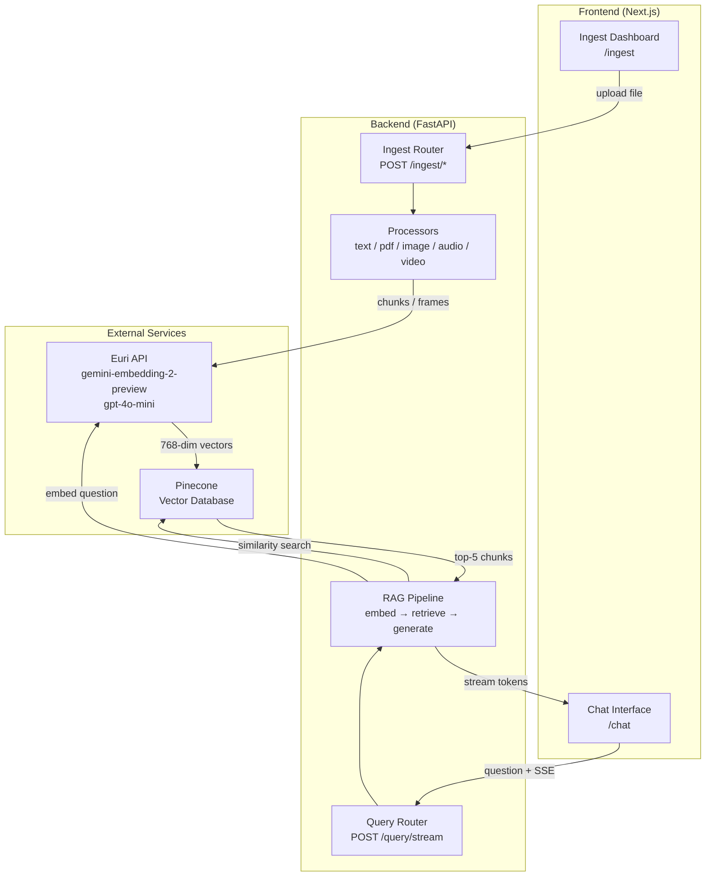
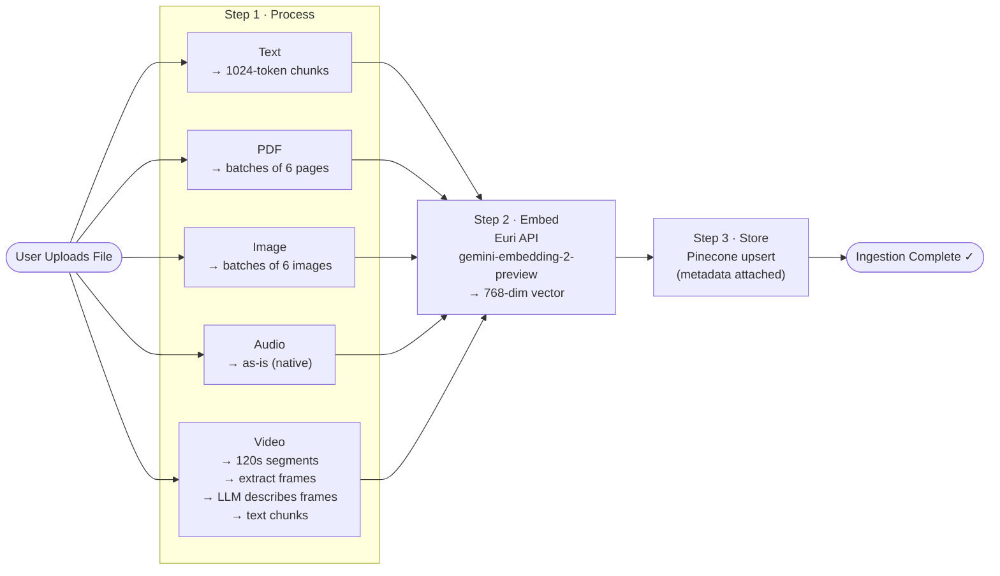
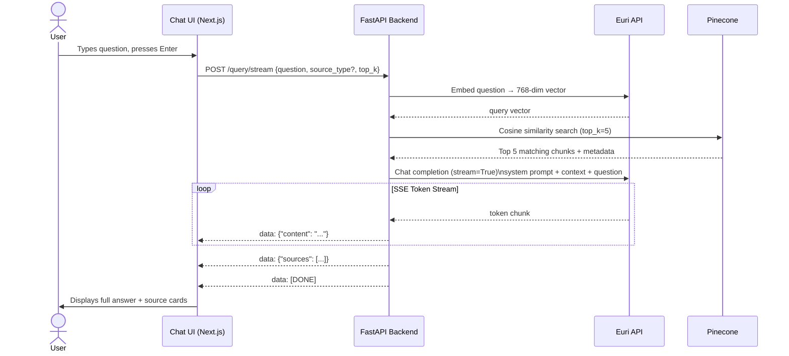
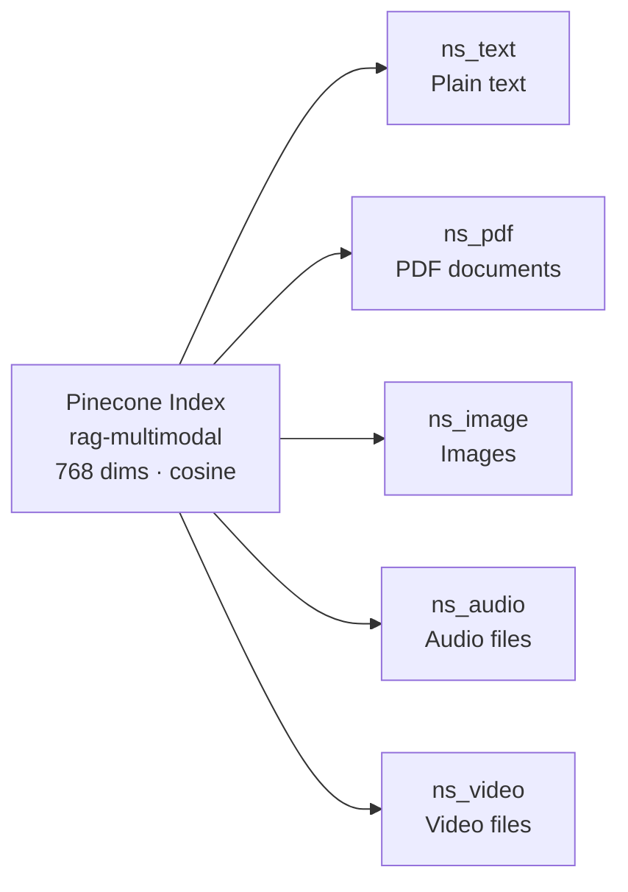

# Multimodal RAG Chat

> A production-ready **Retrieval-Augmented Generation (RAG)** system that understands text, PDFs, images, audio, and video. Upload your content, ask questions, and get streaming AI-generated answers — backed only by what you've ingested.

---

## Table of Contents

1. [Overview](#1-overview)
2. [Tech Stack](#2-tech-stack)
3. [Architecture](#3-architecture)
4. [Setup](#4-setup)
5. [API Reference](#5-api-reference)
6. [Project Structure](#6-project-structure)
7. [Environment Variables](#7-environment-variables)
8. [Running Tests](#8-running-tests)
9. [License](#9-license)

---

## 1. Overview

**Multimodal RAG Chat** is a full-stack AI application that lets you:

- **Ingest** content in 5 formats — plain text, PDFs, images, audio, and video
- **Ask questions** in a ChatGPT-style chat interface
- **Get streaming answers** grounded strictly in your ingested content — no hallucinations
- **See sources** — every answer shows which file and chunk it came from, with a relevance score

| Modality | Supported Formats |
|---|---|
| Text | Paste directly |
| Document | `.pdf` |
| Image | `.png`, `.jpg`, `.jpeg` |
| Audio | `.mp3`, `.wav` |
| Video | `.mp4`, `.mov` |

---

## 2. Tech Stack

**Backend**

| Package | Purpose |
|---|---|
| Python 3.11+ | Runtime |
| FastAPI | REST API + SSE streaming |
| Uvicorn | ASGI server |
| OpenAI Python SDK | Interface to Euri API (embedding + LLM) |
| Pinecone | Vector database |
| PyPDF2 | PDF text extraction |
| LangChain Text Splitters | Recursive text chunking |
| imageio-ffmpeg | Bundled ffmpeg for video frame extraction |
| Tenacity | Retry with exponential back-off |
| python-dotenv | Load `.env` secrets |

**Frontend**

| Package | Purpose |
|---|---|
| Next.js 15 (App Router) | React framework |
| TypeScript | Type-safe development |
| Tailwind CSS v4 | Dark-themed styling |
| React 19 | UI rendering |

**External Services**

| Service | Role |
|---|---|
| Euri API | Single provider for both embedding and LLM calls (OpenAI-compatible) |
| Gemini Embedding 2 Preview | Converts all content into 768-dimensional vectors |
| GPT-4o-mini | Generates answers from retrieved context |
| Pinecone (serverless) | Stores and searches vectors by cosine similarity |

---

## 3. Architecture

### 3.1 System Overview



---

### 3.2 Ingestion Pipeline



---

### 3.3 Query / Chat Pipeline



---

### 3.4 Pinecone Namespace Strategy

Each modality is stored in a dedicated namespace, enabling optional filtering of queries by source type.



---

## 4. Setup

### Prerequisites

- Python 3.11+
- Node.js 18+ and npm
- [Euri API key](https://euron.one)
- [Pinecone API key](https://pinecone.io)
- _(Optional)_ ffmpeg — for accurate video segmentation. The system falls back gracefully without it.

---

### 4.1 Clone the Repository

```bash
git clone <your-repo-url>
cd "Multimodal RAG Chat"
```

### 4.2 Backend Setup

```bash
cd backend

# Create and activate virtual environment
python -m venv venv
venv\Scripts\activate        # Windows
# source venv/bin/activate   # macOS / Linux

# Install dependencies
pip install -r requirements.txt
```

Create `backend/.env` (never commit this file):

```env
EURI_API_KEY=your_euri_api_key_here
EURI_BASE_URL=https://api.euron.one/api/v1/euri
EURI_EMBEDDING_MODEL=gemini-embedding-2-preview
EURI_LLM_MODEL=gpt-4o-mini
PINECONE_API_KEY=your_pinecone_api_key_here
PINECONE_INDEX_NAME=rag-multimodal
```

Start the backend:

```bash
uvicorn app.main:app --reload --port 8000
```

> Interactive API docs: `http://localhost:8000/docs`

---

### 4.3 Frontend Setup

```bash
cd frontend
npm install
```

Create `frontend/.env.local` (never commit this file):

```env
NEXT_PUBLIC_API_URL=http://localhost:8000
```

Start the frontend:

```bash
npm run dev
```

> App runs at: `http://localhost:3000`

---

## 5. API Reference

### Ingestion Endpoints

| Method | Endpoint | Body / Upload | Description |
|---|---|---|---|
| `POST` | `/ingest/text` | JSON `{ text, source_name? }` | Ingest raw text |
| `POST` | `/ingest/pdf` | Multipart file | Ingest a PDF |
| `POST` | `/ingest/image` | Multipart files (1–6) | Ingest PNG / JPEG images |
| `POST` | `/ingest/audio` | Multipart file | Ingest an audio file |
| `POST` | `/ingest/video` | Multipart file | Ingest a video file |

**Ingestion response:**
```json
{
  "status": "success",
  "message": "Successfully ingested 4 text chunk(s).",
  "source_type": "pdf",
  "source_file": "report.pdf",
  "chunks_stored": 4,
  "timestamp": "2024-01-01T00:00:00Z"
}
```

### Query Endpoints

| Method | Endpoint | Description |
|---|---|---|
| `POST` | `/query` | Non-streaming JSON response |
| `POST` | `/query/stream` | Streaming SSE response (recommended for UI) |

**Request body:**
```json
{
  "question": "What are the key findings?",
  "source_type": "pdf",
  "top_k": 5
}
```

> `source_type` is optional. Omit it to search across all modalities.

### Utility Endpoints

| Method | Endpoint | Description |
|---|---|---|
| `GET` | `/health` | Health check |
| `GET` | `/ingested` | List all ingested files with chunk counts |
| `DELETE` | `/ingested?source_type=pdf&source_file=report.pdf` | Remove a file's vectors |

---

## 6. Project Structure

```
Multimodal RAG Chat/
├── backend/
│   ├── .env                        # Secrets — git-ignored
│   ├── requirements.txt
│   ├── pytest.ini
│   └── app/
│       ├── main.py                 # FastAPI app, CORS, startup
│       ├── config.py               # All settings from env vars
│       ├── models/
│       │   └── schemas.py          # Pydantic request/response models
│       ├── services/
│       │   ├── euri_client.py      # Cached OpenAI client → Euri endpoint
│       │   ├── embedding.py        # Embed text / image / audio / video / PDF
│       │   ├── vectorstore.py      # Pinecone upsert, query, delete, list
│       │   ├── llm.py              # LLM generate, SSE stream, video describe
│       │   └── rag_pipeline.py     # Orchestrates embed → retrieve → generate
│       ├── processors/
│       │   ├── text_processor.py   # RecursiveCharacterTextSplitter chunking
│       │   ├── pdf_processor.py    # Page extraction, 6-page batches
│       │   ├── image_processor.py  # Validate & batch PNG/JPEG
│       │   ├── audio_processor.py  # Validate MP3/WAV
│       │   └── video_processor.py  # ffmpeg segmentation + frame extraction
│       ├── routers/
│       │   ├── ingest.py           # POST /ingest/* endpoints
│       │   └── query.py            # POST /query and /query/stream
│       └── tests/
│           ├── test_embedding.py
│           ├── test_vectorstore.py
│           ├── test_processors.py
│           └── test_rag_pipeline.py
└── frontend/
    ├── .env.local                  # API URL — git-ignored
    ├── package.json
    └── src/
        ├── app/
        │   ├── layout.tsx          # Root layout with sidebar
        │   ├── chat/page.tsx       # Chat interface page
        │   └── ingest/page.tsx     # Ingestion dashboard page
        ├── components/
        │   ├── chat/               # ChatWindow, MessageBubble, ChatInput,
        │   │                       # SourceCard, StreamingText
        │   ├── ingest/             # IngestDashboard, FileUploader, TextInput,
        │   │                       # IngestionStatus, IngestedFiles
        │   └── layout/             # Sidebar, Header
        ├── lib/
        │   ├── api.ts              # All backend fetch calls
        │   └── types.ts            # TypeScript interfaces
        └── hooks/
            ├── useChat.ts          # Chat state + SSE streaming
            └── useIngest.ts        # Upload state management
```

---

## 7. Environment Variables

| Variable | File | Required | Default | Description |
|---|---|---|---|---|
| `EURI_API_KEY` | `backend/.env` | Yes | — | API key for embedding + LLM |
| `PINECONE_API_KEY` | `backend/.env` | Yes | — | Pinecone authentication |
| `EURI_BASE_URL` | `backend/.env` | No | `https://api.euron.one/api/v1/euri` | Euri endpoint |
| `EURI_EMBEDDING_MODEL` | `backend/.env` | No | `gemini-embedding-2-preview` | Embedding model |
| `EURI_LLM_MODEL` | `backend/.env` | No | `gpt-4o-mini` | LLM model |
| `PINECONE_INDEX_NAME` | `backend/.env` | No | `rag-multimodal` | Pinecone index name |
| `NEXT_PUBLIC_API_URL` | `frontend/.env.local` | Yes | — | Backend base URL |

> **Never commit `.env` or `.env.local` files.** Both are listed in `.gitignore`.

---

## 8. Running Tests

```bash
cd backend
pytest
```

All external API calls (Euri, Pinecone) are mocked in tests — no real credentials needed to run the test suite.

| Test File | What It Covers |
|---|---|
| `test_embedding.py` | All 5 embedding functions |
| `test_vectorstore.py` | Pinecone upsert, query, delete, list |
| `test_processors.py` | All 5 content processors |
| `test_rag_pipeline.py` | Full end-to-end RAG pipeline |

---

## 9. License

MIT
